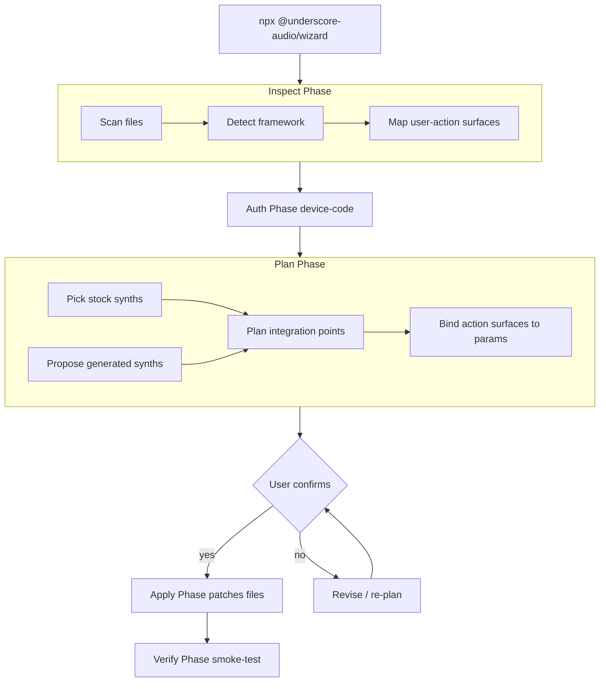

# @underscore-audio/wizard — VISION

> **STATUS: VISION — not yet implemented.** This document captures the
> intended architecture of the magic-install wizard. The shipping
> wizard today does the basics (auth, framework detection, asset copy,
> header patching, key write) — see [`README.md`](./README.md) for what
> is real today. Everything below is forward-looking.

## Vision

MAGIC to install Underscore in an existing arbitrary app for
third-party developers. The wizard inspects the target repo (assuming
the developer has an AI coding agent running, or is willing to work
through the wizard interactively), determines likely places to pull
synths from an existing library AND/OR generate new ones, and lands
the integration in a state where audio is already playing. Bonus:
generate new synths that consider the code context, with parameters
exposed for real-time control from arbitrary application actions.

The bar is "I ran one command and my app makes sound that fits."

## Runtime choice

A generic Node CLI, agent-agnostic. The wizard must be drivable by any
AI coding agent (Cursor, Claude Code, Cline, Aider, …) or by a human
sitting at a terminal. No editor-specific dependencies, no IDE
extensions, no agent-specific protocols. Stdin/stdout for prompts, the
filesystem for diffs, and a documented exit-code contract for
automation.

## Architecture

## The five phases

### 1. Inspect

Read just enough of the target repo to make a good plan. Detect
framework (Vite, Next.js, vanilla HTML, Remix, SvelteKit, …) and
package manager (npm, pnpm, yarn, bun) the way the current wizard
already does. Then go further: extract code-context tags (keywords,
domain words, mood signals from copy/UI strings) and run the
action-surface analyzer described below.

### 2. Auth

Browser device-code flow. Mints a publishable key for the target
project. Idempotent — re-running on a project that already has a key
in `.env.local` re-uses it.

### 3. Plan

Decide what to install:

- Pull one or more sounds from the **stock synth catalog** based on
  the inspect tags.
- Optionally **generate** a new synth that fits the project's vibe and
  context (gated by a confirmation prompt because generation costs
  LLM tokens).
- Build an **action-to-param binding plan**: which detected actions
  should drive which params, with sensible defaults.

The plan is shown to the user (and to a driving agent on stdout) as a
single review-able block before anything mutates.

### 4. Apply

Execute the plan. Every mutation goes through diff-preview first:

- Install `@underscore-audio/sdk` and `supersonic-scsynth`.
- Copy WASM assets into the public dir.
- Patch the build config with COOP/COEP headers (AST-safe rewrites,
  fall back to printing manual changes if the file is unusual).
- Write the publishable key to `.env.local` / `.env` without
  overwriting unrelated values.
- Scaffold a small integration module — Underscore client, a loaded
  synth, and the action-to-param bindings from Phase 3 wired to
  whatever the analyzer found.

### 5. Verify

After Apply, run a lightweight verification: typecheck the project (if
TS), spin up the dev command long enough to confirm it boots, and (if
possible) trigger one of the discovered actions to confirm the audio
graph wakes up. Failure rolls back the Apply step's mutations.

## Three big new pieces

### Action-surface analyzer

Static analysis pass over the target repo to find places where
audio-reactive moments live. Examples: button click handlers, route
transitions, form submissions, hover states, game-loop ticks,
WebSocket message arrivals, error toasts. The analyzer emits a list
of typed action descriptors with file/symbol locations and a
confidence score. It never sends source to the wizard backend — only
the resulting tags and counts (see Privacy + safety).

### Stock synth catalog

A curated, versioned library of public synths the wizard can pull
without paying generation cost. The catalog is queried by tag/vibe
(matched against the Inspect output). The wizard shows the user the
top candidates and lets them swap in or out before applying. Catalog
entries pin a composition+synth pair on the hosted backend.

### Action -> param binding model

A typed contract describing how an action dispatch maps to a synth
parameter change. Concretely: which params are exposed, their
semantic role (intensity / pitch / cutoff / pan / …), what scaling to
use, and what default values follow from each action descriptor. The
binding model lives in the scaffolded integration module and is the
ergonomic core of "real-time control from arbitrary app actions."

## Privacy + safety

- **Source files are never uploaded.** The Inspect phase reads files
  locally; only derived tags, counts, and framework metadata leave
  the machine.
- **Every mutation is diff-previewed** before it runs. The user (or
  driving agent) sees exactly what will change and confirms.
- **Rollback on failure.** Apply steps record what they touched; any
  failure during Apply or Verify reverts the recorded mutations and
  exits non-zero.
- **No silent overwrites.** Existing env vars with the same key are
  never overwritten without an explicit confirm.

## Scope rules

- All wizard code lives in this public repo's `packages/wizard/`.
- Generic only — no consumer-app-specific assumptions, no
  integrations that hard-code one user's stack, no special cases for
  any specific application or design system.
- Anything that needs private infrastructure access (CI live tests,
  staging credentials) lives outside this package.

## Phasing

The vision lands incrementally. In order:

1. **Phase 1 (today): basics.** Auth, framework detect, asset copy,
   header patch, env write. Already shipping.
2. **Phase 2: stock synth catalog.** Tag-based catalog query, top-N
   picker UI, scaffold a working `Underscore` client + `loadSynth`
   call.
3. **Phase 3: action-surface analyzer.** Static pass over the target
   repo, action descriptors emitted to the plan.
4. **Phase 4: action -> param binding model.** Typed bindings in the
   scaffolded module, defaults derived from action descriptors.
5. **Phase 5: optional generation.** Wire the plan into
   `startGeneration` / `subscribeToGeneration` so the wizard can
   generate a context-aware synth in addition to (or instead of)
   pulling from the catalog.

## Open questions

1. Should the catalog backend live in the hosted Underscore service
   (server-rendered list) or in a static CDN (cached JSON)? Tradeoff:
   CDN is cheaper + immutable; a hosted service gives us auth-aware
   filtering later.
2. Bindings runtime as separate packages
   (`@underscore-audio/react-bindings`,
   `@underscore-audio/dom-bindings`, etc.) or as part of the main SDK
   with tree-shaking?
3. "Context-aware generation" — does the wizard send file _content_
   (privacy concern) or only repo-derived _tags_ (less useful)?
